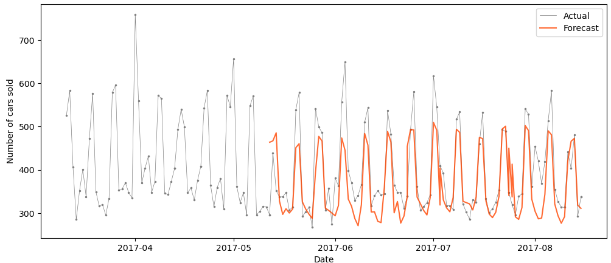
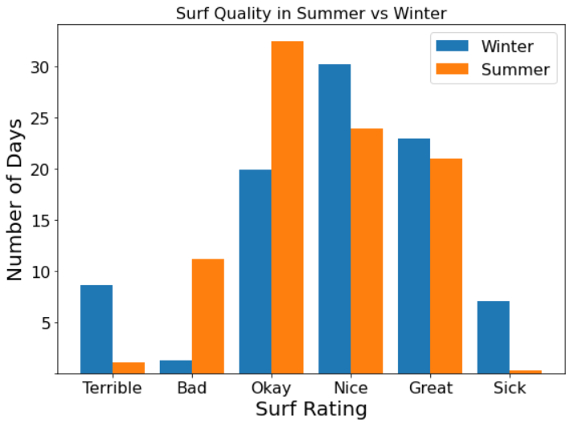
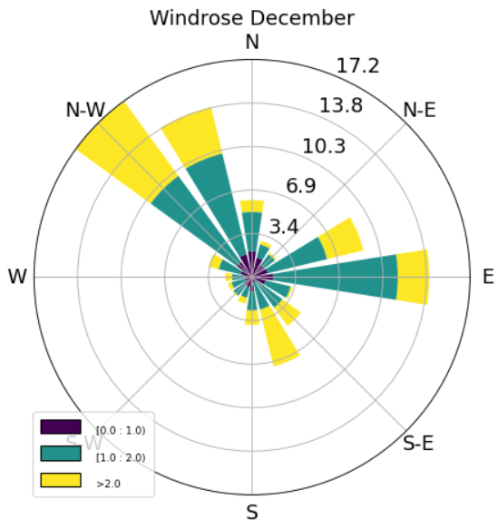

# Data Scientist

### Technical Skills: Python, SQL, Fortran, Pandas, numpy, sklearn
| No Header 1 | No Header 2 | No Header 3 |
|-------------|-------------|-------------|
| Row 1, Col 1 | Row 1, Col 2 | Row 1, Col 3 |
| Row 2, Col 1 | Row 2, Col 2 | Row 2, Col 3 |
## Education
| test | test |
|:-------------|:------------------|
 | Ph.D. Physics | The University of New South Wales, Sydney (_June 2023_) |
 | M.S. Physics | Karlruprecht Universität Heidelberg, Germany (_May 2019_) |

## Projects

### [ NYC Taxi Insights: Unraveling Patterns and Optimization Strategies](https://jcwons.github.io/github-blogs/2023/11/15/NYC-Taxi-Insights-Unraveling-Patterns-and-Optimization-Strategies.html)

 <em><strong>Tools used:</strong> Python, XGBoost, Pandas, Matplotlib, geomaps, seaborn </em>

  
   <strong> Objective: </strong> Use the NYC taxi trip data to maximise the revenue for a taxi company operating in NYC.  
  <strong> Results: </strong> By minimising the wait time of drivers through smart routing after the dropoff, the revenue per driver can be increased leading to a revenue increase of 20% for the company. 
 <strong>Techniques:</strong> Using the extremely large data set with timestamps and geospatial data, I identified busy areas via clustering and engineered the most important feature of wait time. The fare is predicted using XGBoost. <a href="https://jcwons.github.io/github-blogs/2023/11/15/NYC-Taxi-Insights-Unraveling-Patterns-and-Optimization-Strategies.html">Click here to learn more</a>.

### [ Bayesian Optimisiation for Likelihood Sampling](https://arxiv.org/abs/2112.08571)

 <em><strong>Tools used:</strong> Bayesian Optimisation, Gaussian Progress Regression, High-Performance Computing, Bayesian Statistics, Fortran, Python, Bash, git </em>

  
   <strong> Objective: </strong> Improve the optimisation of likelihood functions with multiple maxima.  
  <strong> Results: </strong> Using Machine Learning, I reduced the number of samples required to find the global maximum by a factor of 100 compared to previous results. 
 <strong>Techniques:</strong> I wrote a Gaussian Process Regression and Bayesian Optimisation algorithm in Fortran to efficiently minimise a given likelihood function. Using a High-Performance Computing server, I parallelised the code to run even faster. <a href="https://arxiv.org/abs/2112.08571">Click here for the publciation</a>.

### **Time Series Forecast for Store Sales**
I used **sales data from a store to forecast future sales** using previous data and metadata. I used A/B testing to determine whether holidays and natural disasters affected store sales. Then I compared SARIMA and XGBoost models to forecast the sales, where XGBoost performed the best results. **Future sale numbers were predicted with an 85% accuracy including seasonal trends**.  ([GitHub Repo]([https://github.com/jcwons/BayOp](https://github.com/jcwons/TimeSeriesForecast/))).

*Tools: Python, Pandas, Matplotlib, shapiro, SARIMA, XGBoost*

### **Surf Myths and Car Park Chatter**
I only picked up surfing as a hobby recently, so I don't have the experience to know if what the more experienced surfer is true or just a myth. For this project, I **gathered wind, weather and wave data** to test various surfing concepts that you might hear in the car park or at the beach. This project involved web crawling and scraping for data followed by extensive data exploration, feature engineering and visualization. I found that **winter months are significantly better for surfing than summer months due to more favourable wind directions.** You can find all the details [here](https://github.com/jcwons/SurfMyths-vs-Data).

*Tools: Python, Pandas, Numpy, Matplotlib* 

 

### **Bayesian Optimisiation for Likelihood Sampling of Cosmological Data**
In this project, I changed the Markov Chain Monte Carlo (MCMC) Sampler of the current state-of-the-art likelihood sampler in cosmology to Bayesian Optimisation. This allows for sampling complicated likelihood functions that have multiple local maxima. With the MCMC sampling method, the analysis was very cumbersome and took several weeks to complete. **The new algorithm reduced the runtime down to hours and improved the accuracy by 20%**. The project was published in a top-tier journal ([Publication](https://iopscience.iop.org/article/10.1088/1475-7516/2022/03/036) & [GitHub Repo](https://github.com/jcwons/BayOp)).

*Tools: Bayesian Optimisation, Gaussian Progress Regression, High Performance Computing, Bayesian Statistics, Fortran, Python, Bash, git*

### **Fisher Forecast for upcoming Cosmological Data**
I designed a Python program to forecast constraints for upcoming surveys. The computational expenses for this project were really high requiring several optimisation methods and parallelisation of the code on a high-performance computation cluster. I was able to reduce the computational expenses drastically by finding a statistical relation allowing me to approximate the most time-consuming step. Besides the programming, this medium-sized collaboration required me to liaise with several stakeholders across different continents. The project was published in a top-tier journal ([Publication](https://journals.aps.org/prd/abstract/10.1103/PhysRevD.108.L021305) & [Github Repo](https://github.com/jcwons/ksw_estimator)).

*Tools: Fisher Forecast, High Performance Computing, Parallelisation, Optimisation, Advanced Statistics, Python, Cython, MPI4Py*

### **Stacked Regression for Housing Price Prediction**
In this project, I used US housing data to predict housing prices. I started with an extensive Explorative Data Analysis where I identified the important features, cleaned the data and created new more significant features from existing features. For the modelling, I used two different approaches Tensorflow decision trees and stacking regression models (GradientBoostingRegression, XGBR Regressor, LGBM Regressor, Lasso, Enet, Kernel Ridge Regressor). **I achieved a root-mean-square error of 0.07**. ([notebook](https://github.com/jcwons/HousePrice_Regression/blob/main/eda-stacking-and-tensorflow-decision-trees.ipynb))

*Tools: Python, Tensorflow, Matplotlib, Stacked Regression, Data Exploration, Data Visualisation, Lasso, XGBR, LGBM*

### **Power BI Dashboard for E-Commerce Sales**
In this project, I used public data on **sales from a US E-Commerce Company**. After cleaning the data, I prepared a dashboard to present the data using Power BI. The dashboard shows **YTD data using interactive filters and slicers**. Different charts, tables and maps are used to highlight important features. The project can be found ([here](https://github.com/jcwons/PowerBI_ECommerce)).

*Tools: PowerBI, SQL, Data Cleaning*

